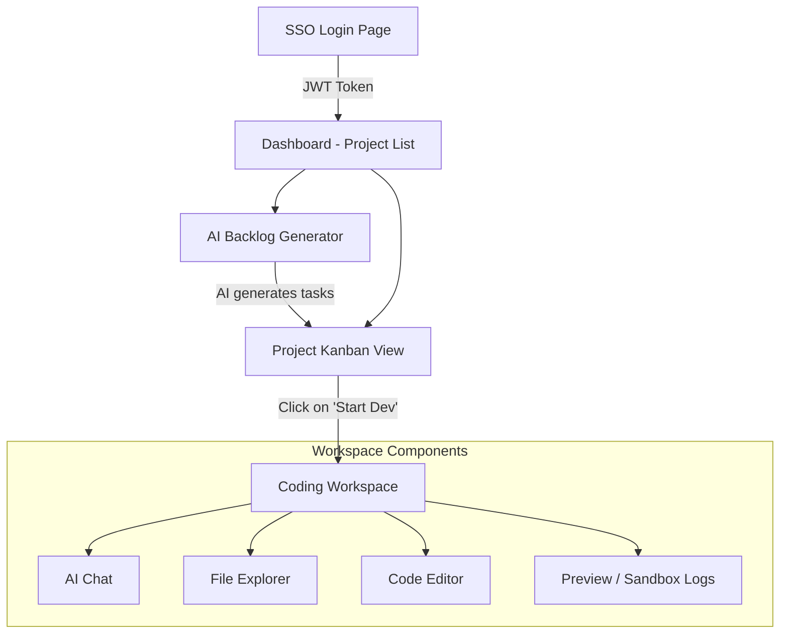
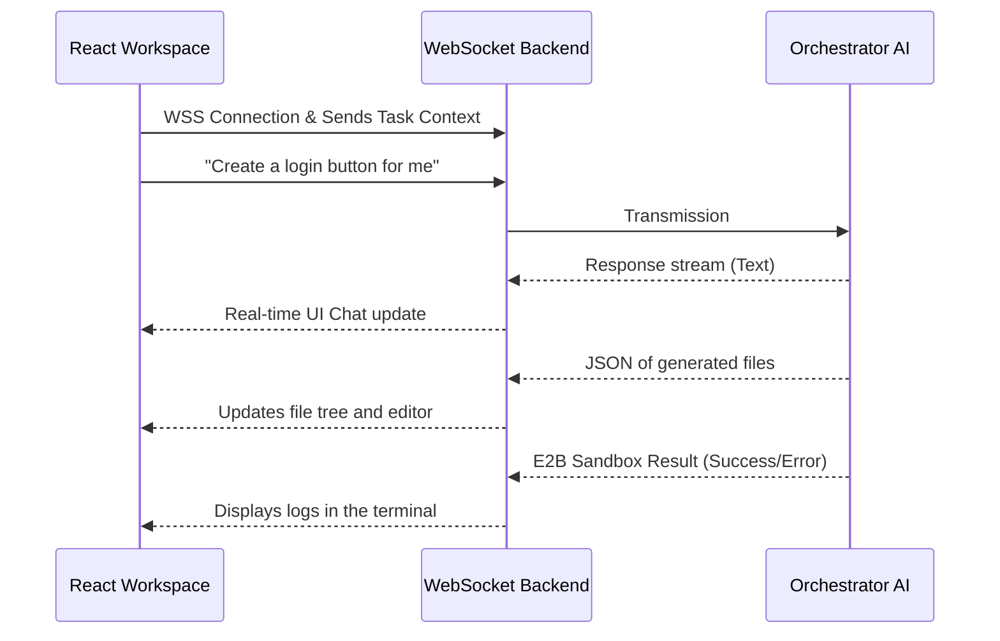

# 🎨 TeraSprint - Frontend

Welcome to the **Frontend** section of TeraSprint. The user interface is designed to be dynamic, fluid, and highly responsive to offer the best experience in project management (Kanban) and automated development (Workspace).

## 🛠️ Technologies Used

- **UI Framework**: [React](https://react.dev/) 18+.
- **Bundler**: [Vite](https://vitejs.dev/) for ultra-fast Hot Module Replacement (HMR).
- **Language**: **TypeScript** for type safety and autocompletion.
- **Styling**: **TailwindCSS** for a modern, clean, and fully responsive design.
- **Real-Time Communication**: Native **WebSockets** for streaming AI code generation.

---

## 🏗️ Architecture and Components

The application follows a classic "Views" (Pages) structure that calls reusable components.

### Navigation Diagram



### The "Coding Workspace" Lifecycle

The innovative core of the frontend is the **Workspace**. This is where the user interacts with the code orchestrator.



---

## 📁 Project Structure

- **`src/`**
  - **`assets/`**: Images, fonts, and global CSS.
  - **`components/`**: 
    - `ui/`: Base components (Buttons, Inputs, Modals, Badges).
    - `kanban/`: Task cards, drag-and-drop columns.
    - `workspace/`: Code editor (often with Monaco Editor or similar), Terminal, File Explorer.
  - **`pages/`**: Main application views (Auth, Dashboard, ProjectBoard, WorkspacePage).
  - **`services/`**: 
    - `api.ts`: Functions to interact with the REST API via `fetch` or `axios`.
    - `socket.ts`: WebSocket connection manager.
  - **`App.tsx`**: Main router (React Router).
  - **`main.tsx`**: React mount point.

---

## ⚙️ Configuration (`.env` / API)

The frontend communicates with the backend via REST calls and WebSockets. Currently, the base URL is configured by default in `src/services/api.ts` and `src/services/socket.ts` to `http://localhost:8000`.

If you need to change the API URL (for example, for production), you can create a `.env` or `.env.local` file at the root of `frontend/` with:

```env
VITE_API_URL=http://your-backend.com/api/v1
VITE_WS_URL=ws://your-backend.com/api/v1
```

*(Be sure to adapt the code in `api.ts` and `socket.ts` to use `import.meta.env.VITE_API_URL` if you wish to use these environment variables).*

---

## 🚀 Installation & Startup

1. **Prerequisites**: Ensure `Node.js` (v18+) is installed.

2. **Install Dependencies**:
   From the `frontend/` folder, run:
   ```bash
   npm install
   ```

3. **Start the Vite Server**:
   ```bash
   npm run dev
   ```

4. **Access the Application**:
   The server usually starts on `http://localhost:5173`. 
   
   *(Note: The frontend is configured to communicate with the backend API. Ensure the FastAPI backend is running on `http://localhost:8000` or adjust the environment variables in a `.env.local` file in the frontend if necessary).*
