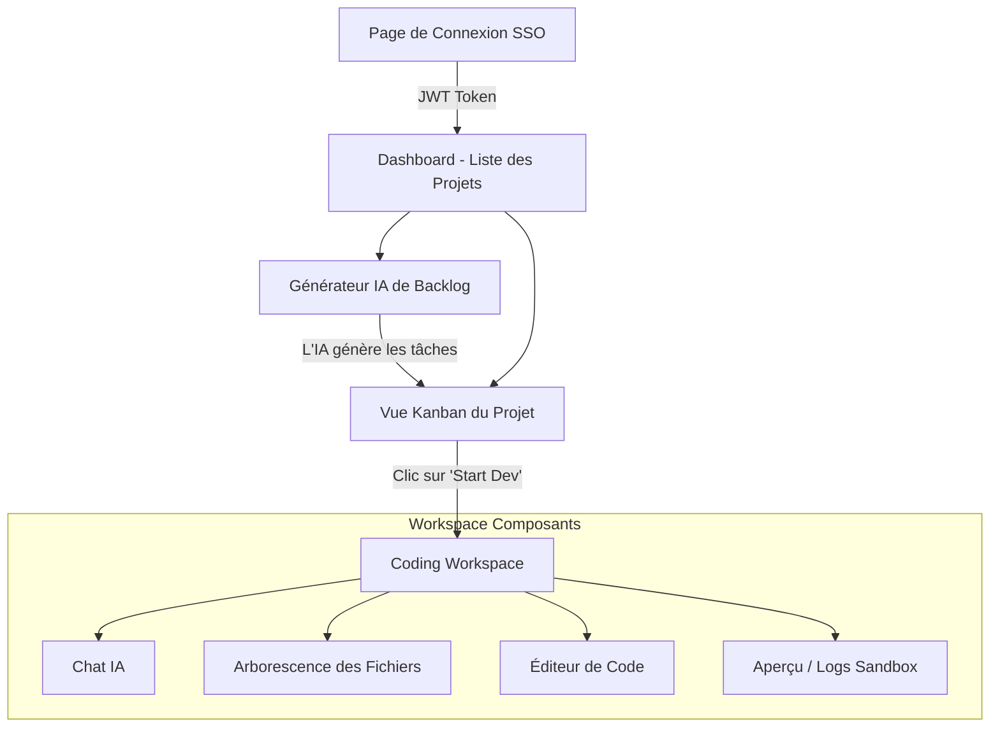
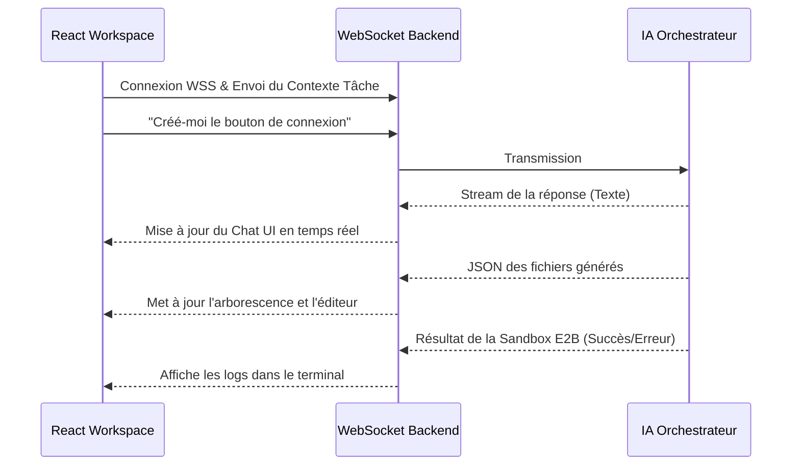

# 🎨 TeraSprint - Frontend

Bienvenue dans la section **Frontend** de TeraSprint. L'interface utilisateur est pensée pour être dynamique, fluide et hautement réactive afin d'offrir la meilleure expérience de gestion de projet (Kanban) et de développement automatisé (Workspace).

## 🛠️ Technologies Utilisées

- **Framework UI** : [React](https://react.dev/) 18+.
- **Bundler** : [Vite](https://vitejs.dev/) pour un rechargement à chaud (HMR) ultra-rapide.
- **Langage** : **TypeScript** pour la sécurité et l'autocomplétion.
- **Styling** : **TailwindCSS** pour un design moderne, épuré et entièrement responsive.
- **Communication Temps Réel** : **WebSockets** natifs pour le streaming de la génération de code par l'IA.

---

## 🏗️ Architecture et Composants

L'application suit une structure classique par "Vues" (Pages) qui appellent des composants réutilisables.

### Diagramme de Navigation



### Le Cycle de Vie du "Coding Workspace"

Le cœur innovant du frontend est le **Workspace**. C'est ici que l'utilisateur dialogue avec l'orchestrateur de code.



---

## 📁 Structure du Projet

- **`src/`**
  - **`assets/`** : Images, fonts, et CSS globaux.
  - **`components/`** : 
    - `ui/` : Composants de base (Boutons, Inputs, Modals, Badges).
    - `kanban/` : Cartes de tâches, colonnes glisser-déposer.
    - `workspace/` : Éditeur de code (souvent avec Monaco Editor ou similaire), Terminal, File Explorer.
  - **`pages/`** : Les grandes vues de l'application (Auth, Dashboard, ProjectBoard, WorkspacePage).
  - **`services/`** : 
    - `api.ts` : Fonctions pour interagir avec l'API REST via `fetch` ou `axios`.
    - `socket.ts` : Gestionnaire de la connexion WebSocket.
  - **`App.tsx`** : Le routeur principal (React Router).
  - **`main.tsx`** : Point de montage React.

---

## ⚙️ Configuration (`.env` / API)

Le frontend communique avec le backend via des appels REST et WebSockets. Actuellement, l'URL de base est configurée par défaut dans `src/services/api.ts` et `src/services/socket.ts` sur `http://localhost:8000`.

Si vous avez besoin de changer l'URL de l'API (par exemple pour la production), vous pouvez créer un fichier `.env` ou `.env.local` à la racine de `frontend/` avec :

```env
VITE_API_URL=http://votre-backend.com/api/v1
VITE_WS_URL=ws://votre-backend.com/api/v1
```

*(Assurez-vous d'adapter le code dans `api.ts` et `socket.ts` pour utiliser `import.meta.env.VITE_API_URL` si vous souhaitez utiliser ces variables d'environnement).*

---

## 🚀 Installation & Démarrage

1. **Prérequis** : Avoir `Node.js` (v18+) installé.

2. **Installer les dépendances** :
   Depuis le dossier `frontend/`, exécutez :
   ```bash
   npm install
   ```

3. **Lancer le serveur Vite** :
   ```bash
   npm run dev
   ```

4. **Accéder à l'application** :
   Le serveur démarre généralement sur `http://localhost:5173`. 
   
   *(Attention : le frontend est configuré pour communiquer avec l'API du backend. Assurez-vous que le backend FastAPI tourne bien sur `http://localhost:8000` ou ajustez les variables d'environnement dans un fichier `.env.local` du frontend si nécessaire).*
